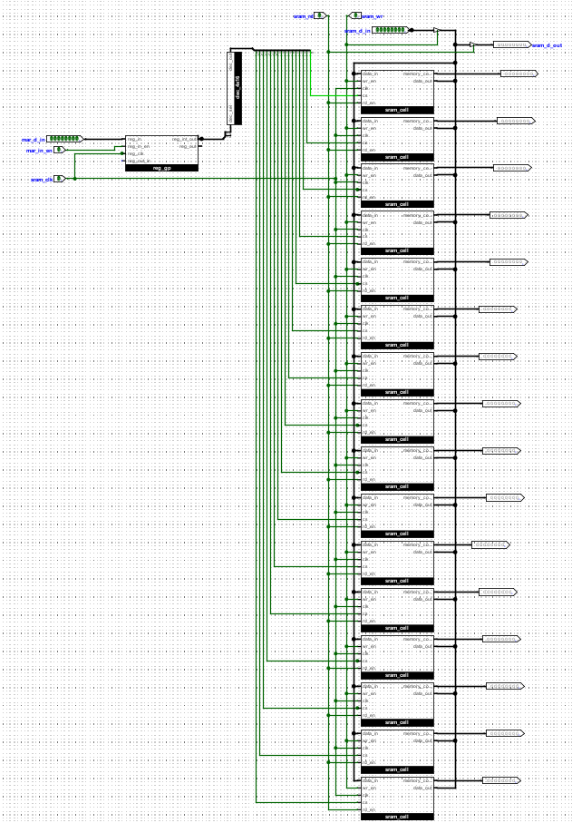
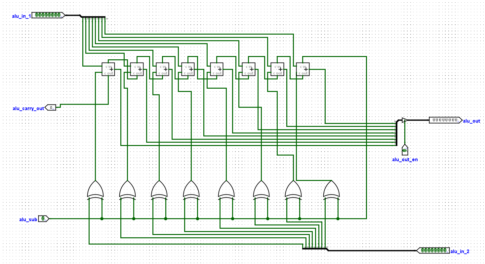

# Control_sequencer_02
# SAP-1-Architecture-Logisim (with Shift/Rotate & Hardwired Control Sequencer)

## Table of Contents
- [Video Tutorials](#video-tutorials)
- [Project Overview](#project-overview)
- [Objectives](#objectives)
- [Key Features](#key-features)

- [Architecture and Functional Block Analysis](#architecture-and-functional-block-analysis)
  - [System Architecture Overview](#system-architecture-overview)
  - [Register Implementation (A, B)](#register-implementation-a-b)
  - [Program Counter (PC) Implementation](#program-counter-pc-implementation)
  - [Memory System and Address Register](#memory-system-and-address-register)
  - [Instruction Register and Opcode Decoder](#instruction-register-and-opcode-decoder)
  - [Arithmetic Logic Unit (ALU) Implementation](#arithmetic-logic-unit-alu-implementation)
  - [Boot/Loader Counter and Phase Generation](#bootloader-counter-and-phase-generation)

- [Control System Design](#control-system-design)
  - [Timing Control Generator](#timing-control-generator)
  - [Automatic Operation Control Logic](#automatic-operation-control-logic)
  - [Manual/Loader Operation Control](#manualloader-operation-control)

- [Instruction Set Architecture](#instruction-set-architecture)
  - [Instruction Encoding Scheme](#instruction-encoding-scheme)
  - [Assembler](#assembler)

- [Operation](#operation)
  - [Fetch–Decode–Execute Cycle](#fetchdecodeexecute-cycle)
  - [Running the CPU in Manual Mode](#running-the-cpu-in-manual-mode)
  - [Running the CPU in Automatic Mode (JMP + ADD Program)](#running-the-cpu-in-automatic-mode-jmp--add-program)

- [Future Improvement](#future-improvement)
- [Conclusion](#conclusion)

---

## Video Tutorials
- 🎬 **Full Demo (YouTube):** https://youtu.be/-9O5nkIznjI?si=oYDJKnNvZ2WQ-s4P

---

## Project Overview
This project implements an enhanced 8-bit **SAP-1** computer in **Logisim Evolution** with a **hardwired control sequencer** and an extended ISA:
`LDA, LDB, ADD, SUB, STA, JMP, HLT, SHL, SHR, ROL, ROR`.

The CPU supports:
- **Automatic Mode** (ring counter T1–T6 + opcode decoder) for a clean fetch–decode–execute pipeline.
- **Manual/Loader Mode** to copy code from ROM to RAM safely (no bus fights).

A small **web assembler** converts assembly into **Logisim v2.0 raw** HEX. The design, section order, and operation notes follow the style of a reference README so it’s easy to study and grade.

---

## Objectives
- Build a didactic SAP-1 (8-bit) with **single shared bus** and **strict one-driver-at-a-time** discipline.
- Demonstrate **automatic control** with a ring counter and AND/OR control matrix.
- Add **JMP** and **single-cycle shift/rotate** (SHL, SHR, ROL, ROR).
- Provide a browser assembler and curated demo programs.

---

## Key Features
- **8-bit datapath, 4-bit address space (16 bytes)**
- **Manual & Automatic** execution modes
- **A/B registers**, **ALU (add/sub)**, **8-bit shifter/rotator**
- **PC** with increment (T3) and **direct load** on `JMP` (T4)
- **IR** split: `IR[7:4]` opcode → decoder; `IR[3:0]` operand → bus on demand
- **ROM→RAM loader** with two non-overlapping phases (`i1`, `i2`)
- **Assembler** → Logisim `v2.0 raw` hex

---

## Architecture and Functional Block Analysis

### System Architecture Overview
Single-bus design with tri-state sources: `pc_out`, `sram_rd`, `ins_reg_out_en`, `a_out`, `b_out`, `alu_out`, `sh_out`.  
Bus listeners/latches: `mar_in_en`, `ins_reg_in_en`, `a_in`, `b_in`, `sram_wr`.  
_Only one driver per T-state_ to avoid contention.

  
*Figure 1: Automatic mode control sequencer (fetch–decode–execute).*

  
*Figure 2: Manual/Loader mode with loader counter and i1/i2 phases.*

### Register Implementation (A, B)
- 8-bit **reg_gp** blocks.  
- Inputs from bus via `a_in`, `b_in`.  
- Outputs to bus via `a_out`, `b_out`.  
- Internal taps (`reg_int_out`) go straight to ALU (no bus needed).

  
*Figure 3: A/B register paths (bus and internal).*

### Program Counter (PC) Implementation
- **T1:** `pc_out` drives bus → MAR for fetch.
- **T3:** `pc_en` increments PC.
- **JMP (T4):** `ins_reg_out_en` drives `IR[3:0]` on bus; `jump_en` loads PC.

  
*Figure 4: PC increment and direct load for JMP.*

### Memory System and Address Register
- 4-bit **MAR**, 16×8 **SRAM**.  
- **Fetch:** `T1 pc_out + mar_in_en`, `T2 sram_rd + ins_reg_in_en`.  
- **Operand addr (LDA/LDB/STA/JMP):** `T4 ins_reg_out_en + mar_in_en`.  
- **Data read/write:** `T5 sram_rd` (LDA/LDB) or `T5 sram_wr` (STA).

  
*Figure 7: MAR/SRAM timing for fetch and memory ops.*

### Instruction Register and Opcode Decoder
- `IR ← M[MAR]` at **T2** (`sram_rd + ins_reg_in_en`).  
- `IR[7:4] →` 4→16 decoder → one-hot lines: `insLDA, insLDB, insADD, insSUB, insSTA, insJMP, insHLT, insSHL, insSHR, insROL, insROR`.  
- `IR[3:0]` can drive the bus when `ins_reg_out_en=1` (used for `JMP` and address phases).

  
*Figure 8: IR split and opcode decoder.*

### Arithmetic Logic Unit (ALU) Implementation
- Ripple adder; `alu_sub=1` selects subtraction.  
- **Execute (ADD/SUB):** **T4** `alu_out=1` (plus `alu_sub` for SUB) and `a_in=1`.

  
*Figure 9: ALU with tri-state output to bus.*

### Boot/Loader Counter and Phase Generation
- Loader counter produces sequential addresses (`bc_address[3:0]`).  
- D-FF creates two **non-overlapping phases** (`i1`: put addr to MAR, `i2`: write RAM from ROM).  
- Active only when `debug=1`.

  
*Figure 10: ROM→RAM loader with i1/i2 phases.*

---

## Control System Design

### Timing Control Generator
Six-phase **ring counter**: **T1–T6** orchestrate all micro-ops (fetch, then execute).

  
*Figure 13: T-state generator.*

### Automatic Operation Control Logic
Use `C = ~debug` and `L = ~i2` (loader idle). Representative equations:

**Fetch**
- `pc_out = T1 & C`  
- `mar_in_en = (T1 & C) | (T4 & C & (insLDA|insLDB|insSTA|insJMP))`  
- `sram_rd = (T2 & C) | (T5 & C & (insLDA|insLDB))`  
- `ins_reg_in_en = T2 & C`  
- `pc_en = T3 & C`

**Execute**
- `alu_out = T4 & C & (insADD | insSUB)`  
- `alu_sub = T4 & C & insSUB`  
- `a_in = (T5 & C & insLDA) | (T4 & C & (insADD|insSUB))`  
- `b_in =  T5 & C & insLDB`

**Shifter / Rotator (single-cycle at T4)**
- `sh_out = T4 & C & (insSHL | insSHR | insROL | insROR)`  
- `sh_dir = C & (insSHR | insROR)`      # 0=left, 1=right  
- `sh_rot = C & (insROL | insROR)`      # 0=shift (zero-fill), 1=rotate  
- `a_in  |= sh_out`                     # latch shifted/rotated A at T4

### Manual/Loader Operation Control
When `debug=1`, normal CPU drivers are masked; the loader uses `i1` to place `bc_address` in MAR and `i2` to write bytes into RAM. Safe, contention-free loading.

---

## Instruction Set Architecture

### Instruction Encoding Scheme
Upper nibble = opcode (`IR[7:4]`), lower nibble = 4-bit operand/address.

| Mnemonic | Upper Nibble | Byte | Meaning |
|---|---:|---:|---|
| **LDA a** | 1 | `1a` | A ← M\[a] |
| **LDB a** | 2 | `2a` | B ← M\[a] |
| **ADD**   | 3 | `30` | A ← A + B |
| **SUB**   | 4 | `40` | A ← A − B |
| **STA a** | 5 | `5a` | M\[a] ← A |
| **JMP a** | 6 | `6a` | PC ← a |
| **SHL**   | 7 | `70` | A ← A << 1 (zero-fill) |
| **SHR**   | 8 | `80` | A ← A >> 1 (zero-fill) |
| **ROL**   | 9 | `90` | rotate left 1 |
| **ROR**   | A | `A0` | rotate right 1 |
| **HLT**   | F | `F0` | halt |

### Assembler
- Directives: `ORG n` (0–15), `DEC n` (0–255).  
- Mnemonics: LDA, LDB, ADD, SUB, STA, JMP, HLT, SHL, SHR, ROL, ROR.  
- Output: **`v2.0 raw`** (16 bytes) compatible with Logisim memory editors.

(Place your assembler HTML in `tools/` and link it here.)

---

## Operation

### Fetch–Decode–Execute Cycle
**T1:** `PC → MAR` · **T2:** `RAM → IR` · **T3:** `PC ← PC+1`  
**Execute (examples):**  
- `LDA a`: **T4** `IR[3:0] → MAR`, **T5** `RAM → A`  
- `ADD/SUB`: **T4** `ALU → A` (with `alu_sub` for SUB)  
- `JMP a`: **T4** `IR[3:0] → PC`  
- `SH*/RO*`: **T4** `Shifter → A` (via `sh_out` + `a_in`)

### Running the CPU in Manual Mode
1. `debug=1` (enter loader), reset PC.  
2. Use i1/i2 pulses to copy ROM→RAM across addresses 0…F.  
3. `debug=0`, reset PC, step the clock and observe **PC, MAR, IR, A, B, bus**.

### Running the CPU in Automatic Mode (JMP + ADD Program)
**Program (JMP→5)**
